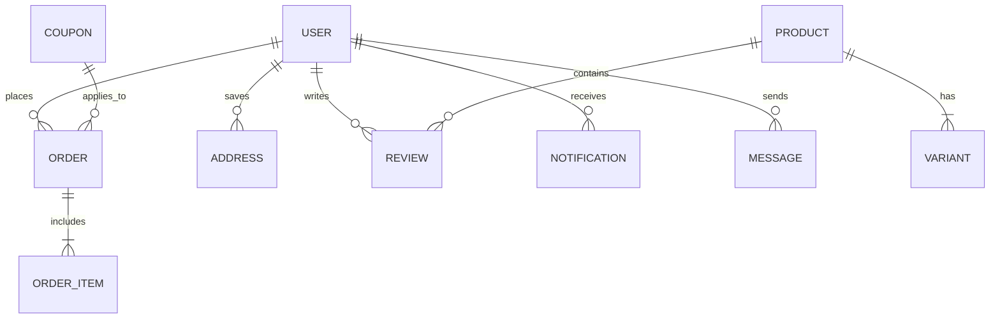

# 🛒 ProShop — Modern Full-Stack eCommerce Platform

[](https://react.dev/)
[](https://vitejs.dev/)
[](https://tailwindcss.com/)
[](https://nodejs.org/)
[](https://expressjs.com/)
[](https://www.mongodb.com/)
[](https://vitest.dev/)
[](https://opensource.org/licenses/MIT)

**ProShop** is a production-ready, full-featured eCommerce web application built with the **MERN stack** (MongoDB, Express, React 19, Node.js). It includes product catalog management with multi-variant pricing, multi-channel authentication (Email + OTP + Social OAuth 2.0), wishlist synchronization, smart shopping cart, coupon discount engine, multi-address management, real-time in-app notifications, live customer chat, interactive analytics dashboards, light/dark mode support, PayPal & VNPay payment gateways, automated Vitest testing suite, and top-tier web performance with route code-splitting and error boundaries.

---

## ✨ Features

### 🛍️ Storefront & Customer Experience
- **Dynamic Catalog & Filtering** — Browse, search, and sort products by price and rating with live stock filtering and pagination.
- **Multi-Variant Architecture** — Multi-variant items (color, size, SKU) with independent pricing, original strike-through pricing, and stock tracking.
- **Product Gallery & Reviews** — High-resolution image gallery with thumbnail preview, customer rating breakdowns, and review submissions.
- **Wishlist Management** — Instant 1-click wishlist toggle with non-blocking optimistic UI and dedicated profile wishlist grid.
- **Smart Cart System** — Variant-aware cart item tracking, real-time inventory quantity validation, and persistent local storage.
- **Coupon Discount Engine** — Discover active promotional coupons, copy codes with 1-click, and apply percentage or fixed discounts with minimum spend validation.
- **Multi-Address Book** — Save multiple shipping addresses with default address selection and modal address management.
- **Order Tracking & Receipts** — Place orders, track delivery lifecycle stages, and view itemized purchase receipts.
- **Multiple Payment Gateways** — Seamless integration with PayPal Smart Buttons and VNPay (Vietnam payment gateway).
- **Real-Time Notifications** — Instant in-app alerts powered by WebSocket for order status updates with unread counter badges.
- **Live Customer Chat** — Socket.IO bidirectional customer-to-admin support chat with typing indicators and image attachments.
- **🌙 Dark & Light Themes** — Fluid dark/light theme switching with system preference detection powered by `next-themes` and `oklch` color spaces.

### ⚡ Performance, SEO & Accessibility (WCAG 2.1 AA)
- **Route Code-Splitting** — All 25+ application routes lazily loaded with `React.lazy()` and `<Suspense>` fallbacks for minimal initial bundle size.
- **Smart Query Caching** — TanStack React Query v5 configured with optimal 1-minute `staleTime` and background refetch controls.
- **Responsive Fluid Layouts** — Fully responsive grid system adapting seamlessly across mobile, tablet, and widescreen monitors.
- **SEO & Social Sharing** — Complete Open Graph meta tags, Twitter Cards, semantic HTML5 structure, and custom SVG favicon.
- **Cumulative Layout Shift (CLS) Prevention** — Explicit aspect-ratio reservations, `loading="lazy"` on catalogs, and `fetchPriority="high"` on hero banners.
- **Accessible Form Controls** — Full WCAG compliance with `aria-label`, autocomplete hints (`current-password`, `new-password`), and accessible button primitives.

### 🛡️ Resilience & Error Handling
- **Global React Error Boundary** — Top-level `<ErrorBoundary>` catching runtime exceptions with friendly recovery UI (Reload / Go Home) and developer debug inspection.
- **Centralized Error Parsing** — Robust `getErrorMessage` helper safely extracting messages across Axios responses, RTK Query payloads, and standard Error instances.
- **Custom 404 Catch-All** — Dedicated `<NotFoundScreen />` route handling unmatched paths with direct navigation recovery.
- **Defensive LocalStorage** — Safe JSON deserialization preventing application crashes from corrupted storage keys.

### 🔐 Authentication & Security Hardening
- **Email + OTP Verification** — Time-sensitive 6-digit one-time password email verification flow via Nodemailer.
- **Social OAuth 2.0** — Single sign-on with Google and Facebook using Passport.js strategies.
- **Secure JWT Authentication** — HTTP-only cookie-based tokens with automated refresh validation.
- **Backend Hardening** — Helmet headers, XSS sanitization (`xss-clean`), NoSQL injection protection (`express-mongo-sanitize`), HPP parameter pollution defense, and rate limiting.

### 📊 Admin Dashboard & Management Suite
- **KPI Summary Analytics** — Real-time metrics on total revenue, order count, registered users, and active products with trend indicators.
- **Interactive Revenue Charts** — Dynamic revenue time-series area charts with date-range filters.
- **Order Distribution Breakdown** — Status breakdown (Delivered, Out for delivery, Unpaid, Cancelled).
- **Low Stock Inventory Monitor** — Real-time alerts for variants running low on stock.
- **Product Management** — Full CRUD with multi-image upload to ImageKit CDN, variant table editor, and status controls (Draft / Active / Schedule).
- **Order & User Management** — Inspect customer orders, mark delivery status, manage user roles, and ban/delete accounts.
- **Live Support Center** — Admin chat dashboard to respond to live customer inquiries in real time.

---

## 🏗️ Tech Stack

### Backend
| Technology | Version | Purpose |
|---|---|---|
| **Node.js** | 18+ | JavaScript server runtime environment |
| **Express.js** | ^4.22 | Fast, unopinionated web framework |
| **MongoDB** + **Mongoose** | ^9.7 | NoSQL document database and schema ODM |
| **JSON Web Token (JWT)** | ^9.0 | Secure stateless session authentication |
| **Passport.js** | ^0.7 | Google & Facebook OAuth 2.0 authentication |
| **Socket.IO** | ^4.8 | Real-time WebSocket engine for chat & notifications |
| **Joi** | ^18.2 | Robust schema validation for API request payloads |
| **ImageKit SDK** | ^6.0 | Cloud media storage and image optimization CDN |
| **Multer** | ^2.2 | Multipart form-data middleware for image uploads |
| **Nodemailer** | ^9.0 | Transactional email & OTP delivery |
| **VNPay SDK** | ^2.5 | Vietnamese banking and e-wallet payment gateway |
| **Helmet / XSS-Clean / HPP** | — | Web security headers, sanitization, and parameter pollution defense |
| **Slugify** | ^1.6 | Clean, SEO-friendly URL slug generation |

### Frontend
| Technology | Version | Purpose |
|---|---|---|
| **React** | ^19.2 | Modern UI library with automatic React Compiler support |
| **Vite** | ^8.1 | Next-generation frontend tooling and fast HMR bundler |
| **Tailwind CSS** | ^4.3 | Utility-first CSS framework with modern `@theme` design tokens |
| **TanStack React Query** | ^5.101 | Asynchronous server-state management and query caching |
| **Redux Toolkit** | ^2.12 | Client state management (Cart, Auth, Chat + Socket middleware) |
| **React Router DOM** | ^7.18 | Declarative client-side routing with code-splitting & route guards |
| **React Hook Form** + **Zod** | ^7.85 / ^4.4 | Type-safe form state handling and validation schemas |
| **Base UI / Shadcn / ReUI** | — | Accessible, headless UI primitives and design components |
| **next-themes** | ^0.4 | Dark/Light mode theme provider with system detection |
| **Lucide React** | ^1.24 | Consistent, lightweight vector icons |
| **Sonner** | ^2.0 | High-performance toast notification stack |
| **PayPal React SDK** | ^10.1 | Official PayPal Smart Payment Buttons integration |
| **Socket.IO Client** | ^4.8 | Real-time client socket connection |
| **Vitest** + **Happy DOM** | ^4.1 / ^20.11 | Ultra-fast unit testing framework and virtual browser DOM |

---

## 📁 Project Structure

```
proshop/
├── backend/
│   ├── app.js                   # Express application setup & middleware configuration
│   ├── server.js                # Server entry point + Socket.IO initialization
│   ├── seeder.js                # Database seed / destroy CLI runner
│   ├── config/
│   │   ├── db.js                # MongoDB connection handler
│   │   ├── imageKit.js          # ImageKit cloud storage credentials
│   │   ├── mailer.js            # Nodemailer SMTP transporter setup
│   │   ├── passport.js          # Google & Facebook OAuth strategies
│   │   └── security.js          # Security headers & sanitization rules
│   ├── controller/
│   │   ├── productController.js # Product CRUD, filtering, reviews, variants
│   │   ├── userController.js    # Auth, registration, OTP, profile, wishlist
│   │   ├── orderController.js   # Order creation, PayPal capture, delivery tracking
│   │   ├── paymentController.js # VNPay URL generation & IPN callback
│   │   ├── addressController.js # Multi-address management
│   │   ├── couponController.js  # Coupon validation and admin CRUD
│   │   ├── messagesController.js# Chat conversation threads and history
│   │   ├── notificationController.js # In-app notification management
│   │   └── analyticsController.js # Dashboard KPIs, revenue, stock analytics
│   ├── middleware/
│   │   ├── authMiddleware.js     # JWT verification, admin guard, optional auth
│   │   ├── errorMiddleware.js    # Centralized error handler & 404 handler
│   │   ├── asyncHandler.js       # Async error wrapper for controllers
│   │   ├── uploadMiddleware.js   # Multer file upload configuration
│   │   └── validateMiddleware.js  # Joi schema validation runner
│   ├── model/
│   │   ├── productsModel.js      # Product, Variant, Image, Review schemas
│   │   ├── userModel.js          # User schema with bcrypt & wishlist references
│   │   ├── orderModel.js         # Order schema with snapshot tracking
│   │   ├── addressModel.js       # User shipping address schema
│   │   ├── couponModel.js        # Coupon schema with usage limits
│   │   ├── messagesModel.js      # Real-time chat messages schema
│   │   └── notificationModel.js  # User notification alert schema
│   ├── routes/
│   │   ├── index.js              # Route aggregation hub
│   │   ├── productRoutes.js
│   │   ├── userRoutes.js
│   │   ├── orderRoutes.js
│   │   ├── uploadRoutes.js
│   │   ├── addressRoute.js
│   │   ├── couponRoute.js
│   │   ├── messageRoute.js
│   │   ├── notificationRoutes.js
│   │   └── analyticsRoute.js
│   ├── socket/                   # Real-time Socket.IO event handlers
│   ├── utils/                    # JWT generator, API Query features, custom errors
│   ├── validator/                # Joi validation schemas for requests
│   └── data/                     # Seed dataset (users, products, coupons)
│
├── frontend/
│   ├── index.html                # HTML5 entry with SEO tags, Open Graph & SVG Favicon
│   ├── vite.config.js            # Vite configuration with React & Tailwind v4 plugins
│   ├── vitest.config.js          # Vitest testing setup with Happy DOM & path aliases
│   ├── public/
│   │   ├── favicon.svg           # Scalable vector favicon
│   │   ├── screenLight.svg       # Light mode auth hero vector graphic
│   │   └── screenDark.svg        # Dark mode auth hero vector graphic
│   └── src/
│       ├── main.jsx              # App root with Redux Provider & ErrorBoundary
│       ├── App.jsx               # Lazy route definitions, Suspense & QueryClient
│       ├── store.js              # Redux Toolkit store (Cart, Auth, Chat)
│       ├── index.css             # Design tokens, color spaces (oklch) & CSS resets
│       ├── components/           # Reusable UI primitives, headers, layouts, guards
│       │   ├── ErrorBoundary.jsx # Top-level React error boundary component
│       │   ├── AppLayout.jsx     # Storefront responsive layout (Header + Main + Footer)
│       │   ├── AppLayoutAdmin.jsx# Admin panel layout with mobile SidebarTrigger
│       │   ├── PrivateRoutes.jsx # Route guard for authenticated customers
│       │   ├── AdminRoutes.jsx   # Route guard for administrators
│       │   └── ui/               # Base UI / Shadcn / ReUI primitives
│       ├── screens/              # Top-level screen components
│       │   ├── HomeScreen.jsx
│       │   ├── ProductScreen.jsx
│       │   ├── CartScreen.jsx
│       │   ├── LoginScreen.jsx
│       │   ├── RegisterScreen.jsx
│       │   ├── ProfileScreen.jsx
│       │   ├── OrderScreen.jsx
│       │   ├── CouponScreen.jsx
│       │   ├── NotFoundScreen.jsx# 404 Not Found error recovery screen
│       │   └── admin/            # Admin screens (Dashboard, Orders, Products, Users, Coupons, Chat)
│       ├── features/             # Domain-driven modular architecture
│       │   ├── authentication/   # Auth forms, hooks, profile & notifications
│       │   ├── product/          # Product details, gallery, pricing, review hooks
│       │   ├── cart/             # Cart slice, items, calculations (`cartUtils.js`)
│       │   │   └── utils/
│       │   │       ├── cartUtils.js
│       │   │       └── __tests__/cartUtils.test.js # Unit test suite for cart calculations
│       │   ├── checkout/         # Shipping flow, PayPal & VNPay integrations
│       │   ├── order/            # Order receipts, payment approvals, admin delivery
│       │   ├── address/          # Address list, address modal, mutation hooks
│       │   ├── coupon/           # Coupon discovery, copy-to-clipboard, coupon cards
│       │   ├── chat/             # Real-time customer chat widget & typing indicators
│       │   ├── home/             # Featured banner, product catalog, filters
│       │   └── admin/            # Admin management pages, revenue charts, stock alerts
│       └── lib/                  # Shared utilities & configurations
│           ├── utils.js          # Class merger (`cn`), currency formatter, storage helpers
│           ├── errorUtils.js     # Centralized error message parser
│           ├── queryClient.js    # TanStack Query client with caching policies
│           └── __tests__/        # Unit tests for error parsing & auth logic
│
├── package.json                  # Root monorepo script runner
├── example.env                   # Environment variable template
├── FRONTEND_AUDIT_REPORT.md      # Comprehensive 385-rule frontend audit report
└── README.md
```

---

## 🚀 Getting Started

### Prerequisites
- **Node.js** >= 18.x
- **MongoDB** (Local instance or [MongoDB Atlas](https://www.mongodb.com/atlas))
- **npm** >= 9.x

### 1. Clone the Repository
```bash
git clone https://github.com/Annv11022005/ProShop.git
cd ProShop
```

### 2. Install Dependencies
```bash
# Install backend dependencies
npm install

# Install frontend dependencies
cd frontend
npm install
cd ..
```

### 3. Configure Environment Variables
Copy the template file to `.env`:
```bash
cp example.env .env
```

Fill in your configuration details in `.env`:
```env
NODE_ENV=development
PORT=5000
MONGO_URI=mongodb+srv://<username>:<password>@cluster.mongodb.net/proshop
JWT_SECRET=your_jwt_secret_key

# PayPal Integration
PAYPAL_CLIENT_ID=your_paypal_client_id

# ImageKit (Cloud Image Upload CDN)
IMAGEKIT_PUBLIC_KEY=your_imagekit_public_key
IMAGEKIT_PRIVATE_KEY=your_imagekit_private_key
IMAGEKIT_URL_ENDPOINT=https://ik.imagekit.io/your_id

# Nodemailer (OTP Verification Emails)
MAIL_HOST=smtp.gmail.com
MAIL_PORT=587
MAIL_USER=your_email@gmail.com
MAIL_PASS=your_app_password

# Social OAuth 2.0
GOOGLE_CLIENT_ID=your_google_client_id
GOOGLE_CLIENT_SECRET=your_google_client_secret
FACEBOOK_APP_ID=your_facebook_app_id
FACEBOOK_APP_SECRET=your_facebook_app_secret

# VNPay Payment Gateway
VNPAY_TMN_CODE=your_vnpay_terminal_code
VNPAY_SECURE_SECRET=your_vnpay_secret
VNPAY_URL=https://sandbox.vnpayment.vn/paymentv2/vpcpay.html
VNPAY_RETURN_URL=http://localhost:5173/vnpay-return
```

### 4. Seed Database Sample Data (Optional)
```bash
# Import sample dataset (Admin user, demo customers, multi-variant products, coupons)
npm run data:import

# Wipe database
npm run data:destroy
```

### 5. Run the Application
```bash
# Run both Backend (port 5000) and Frontend (port 5173) concurrently
npm run dev
```

Open your browser at **http://localhost:5173**.

---

## 🧪 Automated Testing

ProShop includes an automated test suite powered by **Vitest** and **Happy DOM**:

```bash
# Run all unit tests from root
npm test

# Or run directly in frontend
cd frontend
npm test

# Run tests in interactive watch mode
npx vitest
```

### Test Suites Covered:
- **`cartUtils.test.js`** — Tests item price summing, shipping fee threshold (free shipping ≥ 500k VND), 15% tax calculations, percentage and fixed coupon discount engine, zero-floor clamping, and localStorage persistence.
- **`errorUtils.test.js`** — Tests parsing for Axios error responses, RTK Query errors, JavaScript Error instances, string errors, and fallback strings.
- **`authGuards.test.js`** — Tests route authorization logic for private customer routes and admin-only routes.

---

## 📡 API Reference Summary

Base URL: `http://localhost:5000`

### 📦 Products — `/api/v1/products`
| Method | Endpoint | Auth | Description |
|---|---|---|---|
| `GET` | `/` | Public | Paginated product list with search, category, brand, stock, and price sorting |
| `POST` | `/` | Admin | Create a new product with variants and media |
| `GET` | `/top` | Public | Get top-rated featured products |
| `GET` | `/:slugOrId` | Public | Get product by slug or ObjectId |
| `PUT` | `/:id` | Admin | Update product details, images, variants |
| `DELETE` | `/:id` | Admin | Remove product |
| `POST` | `/:id/reviews` | User | Submit rating & review for a product |

### 👤 Users & Wishlist — `/api/v1/users`
| Method | Endpoint | Auth | Description |
|---|---|---|---|
| `POST` | `/` | Public | Register account & trigger OTP email |
| `POST` | `/register/verify` | Public | Verify OTP code and activate account |
| `POST` | `/login` | Public | Authenticate user & set JWT cookie |
| `POST` | `/logout` | Public | Clear auth cookie |
| `GET` | `/profile` | User | Get current profile |
| `PUT` | `/profile` | User | Update profile credentials |
| `GET` | `/wishlist` | User | Retrieve customer's saved wishlist |
| `POST` | `/wishlist` | User | Add product to wishlist |
| `DELETE` | `/wishlist/:productId` | User | Remove product from wishlist |
| `GET` | `/` | Admin | List all registered users |
| `GET` | `/:id` | Admin | Get user by ID |
| `PUT` | `/:id` | Admin | Update user details & admin privileges |
| `DELETE` | `/:id` | Admin | Delete user account |

### 📋 Orders & Payments — `/api/v1/orders`
| Method | Endpoint | Auth | Description |
|---|---|---|---|
| `POST` | `/` | User | Create a new order with items and address |
| `GET` | `/mine` | User | Retrieve order history of current user |
| `GET` | `/:id` | User | Get detailed order receipt |
| `PUT` | `/:id/pay` | User | Mark order as paid (PayPal capture) |
| `POST` | `/:id/vnpay/create` | User | Generate VNPay transaction URL |
| `GET` | `/` | Admin | List all store orders |
| `PUT` | `/:id/deliver` | Admin | Update order status to delivered |

### 📍 Addresses — `/api/v1/address`
| Method | Endpoint | Auth | Description |
|---|---|---|---|
| `GET` | `/` | User | Get all saved shipping addresses |
| `POST` | `/` | User | Create a new shipping address |
| `GET` | `/default` | User | Get default delivery address |
| `PUT` | `/:id` | User | Update address or toggle as default |
| `DELETE` | `/:id` | User | Delete saved address |

### 🎟️ Coupons — `/api/v1/coupons`
| Method | Endpoint | Auth | Description |
|---|---|---|---|
| `GET` | `/` | Public/Admin | Get all active coupons (public) or all coupons (admin) |
| `POST` | `/validate` | User | Validate and calculate coupon discount for order |
| `POST` | `/` | Admin | Create discount coupon |
| `PUT` | `/:id` | Admin | Update coupon properties |
| `DELETE` | `/:id` | Admin | Delete a coupon |

### 🔔 Notifications & Chat
| Method | Endpoint | Auth | Description |
|---|---|---|---|
| `GET` | `/api/v1/notifications` | User | Get user in-app notification alerts |
| `GET` | `/api/v1/notifications/unread-count` | User | Get unread notification counter |
| `PUT` | `/api/v1/notifications/read-all` | User | Mark all notifications as read |
| `GET` | `/api/v1/messages` | Admin | Get all live chat conversation threads |
| `GET` | `/api/v1/messages/:userId` | User | Get message history for user |
| `POST` | `/api/v1/messages` | User | Send a chat message |

### 📊 Admin Analytics — `/api/v1/analytics`
| Method | Endpoint | Auth | Description |
|---|---|---|---|
| `GET` | `/summary` | Admin | Overview KPIs: revenue, orders, users, products |
| `GET` | `/revenue` | Admin | Daily/weekly revenue time-series for charts |
| `GET` | `/orders-status` | Admin | Order distribution by status |
| `GET` | `/low-stock` | Admin | Critical low-stock inventory list |
| `GET` | `/top-products` | Admin | Best-selling products by quantity and revenue |

---

## 🗄️ Database Schemas Overview



---

## 📜 NPM Scripts Reference

| Command | Location | Description |
|---|---|---|
| `npm run dev` | Root | Run backend and frontend concurrently |
| `npm run server` | Root | Run backend only with Nodemon auto-restart |
| `npm run client` | Root | Run frontend only with Vite dev server |
| `npm test` | Root / Frontend | Run automated Vitest test suite |
| `npm run data:import` | Root | Seed demo users, products, and coupons into MongoDB |
| `npm run data:destroy` | Root | Wipe all database collections |
| `npm run lint` | Frontend | Run ESLint syntax and code quality checks |
| `npm run build` | Frontend | Build production-ready frontend bundle |
| `npm run preview` | Frontend | Preview production build locally |

---

## 📄 License

This project is open-source and licensed under the **[MIT License](LICENSE)**.

---

## 👤 Author

**Anify** — [GitHub Profile](https://github.com/Annv11022005)
